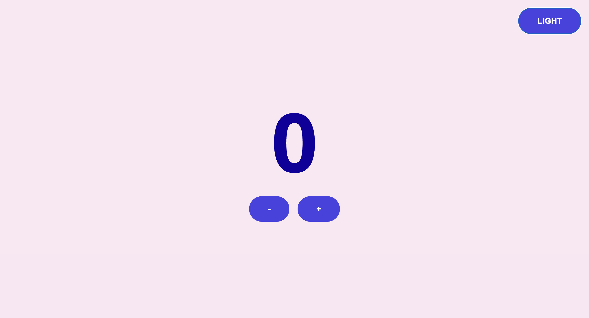

 # js-counter
 🔗 [WebSite](https://js-counter-ms.netlify.app/)
 

This is a simple website featuring a counter implemented using JavaScript. The website also includes a button that allows users to switch between light and dark modes for a personalized viewing experience.

## Features

- **Counter**: The main feature of the website is a counter that can be incremented.
- **Light/Dark Mode Toggle**: Users can switch between light and dark modes by clicking on the dedicated button.

## Technologies Used

- **HTML**: The structure of the website is built using HTML.
- **CSS**: Styling is done with CSS to enhance the visual appeal.
- **JavaScript**: The counter functionality and mode toggling are implemented using JavaScript.

## Screenshots

